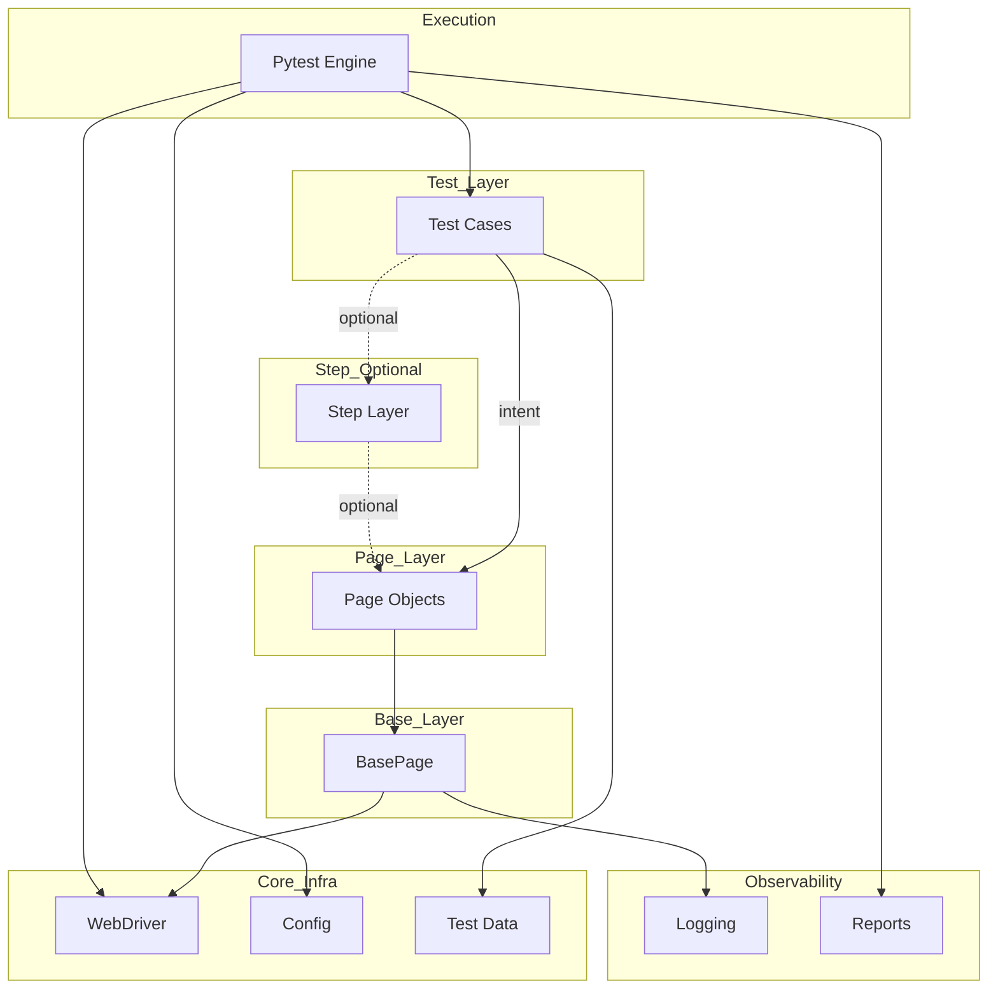
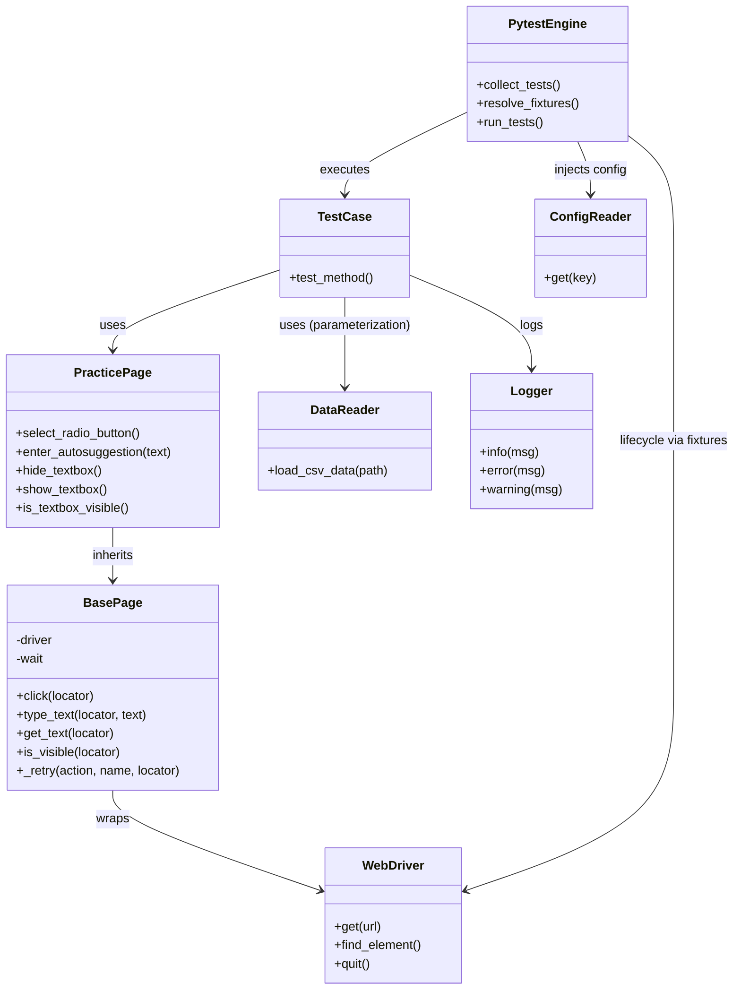
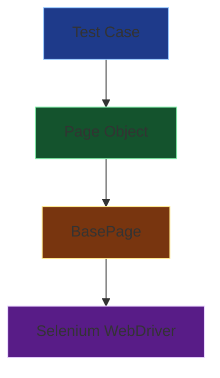

# 🧪 Automation Practice Website — Python Framework Workshop

This repository represents a **phase-by-phase automation framework workshop**, built on top of:
[https://rahulshettyacademy.com/AutomationPractice/](https://rahulshettyacademy.com/AutomationPractice/)

> ⚠️ **Important**  
> This repository is **not a sample test project**.  
> It is a **learning-driven framework design workshop**, focused on *how and why* a scalable automation framework is built.

---

## 🎯 Workshop Objectives

- Build a **production-grade Selenium + Pytest hybrid framework**
- Understand **framework architecture decisions**
- Learn **test lifecycle, abstraction, stability, and scalability**
- Become **interview-ready for Senior Automation / SDET roles**

---

## 🧰 Technology Stack

| Category           | Tool                          |
| ------------------ | ----------------------------- |
| Language           | Python                        |
| Test Framework     | Pytest                        |
| UI Automation      | Selenium WebDriver            |
| Driver Management  | webdriver-manager             |
| Configuration      | YAML                          |
| Data Driven        | CSV + Pytest parameterization |
| Reporting          | pytest-html, Allure           |
| Logging            | Python logging                |
| Parallel Readiness | pytest-xdist (design preview) |
| CI Readiness       | Yes (design-level)            |

---

## 📁 Framework Folder Structure

```text
Automation-Practice-Website/
│
├── base/
│   └── base_page.py
│
├── pages/
│   └── practice_page.py
│
├── config/
│   └── config.yaml
│
├── utils/
│   ├── config_reader.py
│   ├── datareader.py
│   └── logger.py
│
├── tests/
│   └── test_*.py
│
├── conftest.py
├── run_test.py
│
├── reports/            # pytest-html reports
├── allure-results/     # Allure raw results
├── allure-report/      # Allure HTML output
├── screenshots/
│
└── README.md
```

---

## 🧠 Conceptual Test Flow

```text
Test
 ↓
Page Object
 ↓
BasePage
 ↓
Selenium WebDriver
```

- Tests express intent
- Page Objects express UI behavior
- BasePage handles interaction mechanics
- Selenium controls the browser

---

## 🧩 Framework Architecture
```md
## 🧪 Conceptual Test Flow
```


Here is the **Architecture** section formatted in clean GitHub Markdown. I have used a combination of bold headers and bullet points to ensure the hierarchy is clear and easy to read.

---

## 🧠 Architecture Explained Layer by Layer

### 🟦 Test Layer
- **Expresses what to validate**
- Uses Page Objects (or Step Layer)
- Contains assertions
- No infrastructure logic

### 🟨 Step Layer (Optional, Advanced)
- Orchestrates business flows
- Uses composition over inheritance
- Sits between Test and Page
- Introduced only when scale demands

### 🟩 Page Layer
- Models UI behavior
- **One page = one class**
- No Selenium noise
- Stable even when tests change

### 🟧 Base Layer
- **Handles technical mechanics:**
    - Explicit/Implicit waits
    - Retry logic
    - Element visibility
    - Error normalization
- Single point of technical control

### 🟥 Core Infrastructure
- WebDriver lifecycle management
- Configuration management (env, browser, URL)
- Test data sources
- Fully externalized from logic

### 🟪 Observability
- **Logs** for traceability
- **Reports** for evidence (Allure/HTML)
- **Screenshots** for failures
- Activated via Pytest hooks

### 🟫 Execution Engine (Pytest)
- **Owns the lifecycle:**
    - Test discovery
    - Dependency injection (Fixtures)
    - Fixture lifecycle
    - Hooks and parallelization
- Framework aligns with it, does not override it


```md
## 🧪 Class Diagram
```

```md
## 🧪 Conceptual Test Flow
```


Here’s a well‑structured **README section** you can drop directly into your project. It explains the **pytest lifecycle** and outlines a **test automation approach**, complete with a **Mermaid diagram** in Markdown.

---

## 🧪 Pytest Lifecycle & Test Automation Approach

### 🔄 Pytest Lifecycle
Pytest follows a clear lifecycle when executing tests:

- **Test Discovery**  
  - Collects test files matching `test_*.py` or `*_test.py`.  
  - Identifies functions/classes prefixed with `test`.

- **Fixture Setup**  
  - Initializes resources (e.g., database connections, browser drivers).  
  - Supports modular, reusable fixtures with scopes (`function`, `class`, `module`, `session`).

- **Test Execution**  
  - Runs tests sequentially or in parallel (with plugins like `pytest-xdist`).  
  - Applies fixtures, markers, and parametrization.

- **Assertion & Reporting**  
  - Validates expected vs. actual outcomes.  
  - Generates reports (console, JUnit XML, Allure, HTML).

- **Teardown**  
  - Cleans up resources (closing files, disconnecting DB, quitting browsers).  
  - Ensures environment stability for subsequent runs.

---

### ⚙️ Test Automation Approach
Our automation framework is designed for **scalability, maintainability, and CI/CD integration**:

- **Page Object Model (POM)** for structured test design.  
- **Data‑Driven Testing** using externalized test data (CSV, JSON, YAML).  
- **Configuration Management** for environment‑specific settings.  
- **Logging & Reporting** with Allure/HTML reports for traceability.  
- **CI/CD Integration** with Jenkins/GitHub Actions for automated pipelines.  
- **Parallel Execution** to reduce runtime and improve efficiency.  
- **Scalability** with modular utilities and reusable fixtures.

---

### 📊 Mermaid Diagram

```mermaid
flowchart TD
    A[Test Discovery] --> B[Fixture Setup]
    B --> C[Test Execution]
    C --> D[Assertions & Validations]
    D --> E[Reporting]
    E --> F[Teardown & Cleanup]

    subgraph Automation Approach
        G[Page Object Model]
        H[Data Driven Testing]
        I[Config Management]
        J[Logging & Reporting]
        K[CI/CD Integration]
        L[Parallel Execution]
    end

    C --> Automation Approach
```

---

## 🧱 Phase-by-Phase Framework Evolution

### Phase 1 — Framework Bootstrap

- Raw Selenium + Pytest smoke test
- Environment & tooling validation

**Focus:** Prove automation can run

---

### Phase 2 — Fixtures & Lifecycle Management

- Introduced `conftest.py`
- Browser lifecycle via fixtures
- Dependency Injection

**Focus:** Centralized setup & teardown

---

### Phase 3 — BasePage Abstraction

- Centralized waits & Selenium actions
- Retry mechanism & error handling
- Reduced flakiness

**Focus:** Stability & consistency

---

### Phase 4 — Page Object Model (POM)

- UI structure isolated
- Locators centralized
- Tests became readable

**Focus:** Maintainability

---

### Phase 5 — Configuration Management

- YAML-based environment config
- CLI environment switching (`--env`)
- No hardcoded values

**Focus:** Environment agnosticism

---

### Phase 6 — Driver Lifecycle & Execution Control

- Session-level driver reuse
- Autouse page reset
- Data-driven stability
- Parallel-ready design

**Focus:** Speed + isolation

---

### Phase 6 (Preview) — Parallel Execution

- pytest-xdist vs CI agent comparison
- Design readiness without enabling

**Focus:** Scalability awareness

---

### Phase 7 — Logging, Screenshots & Hooks

- Centralized logging
- Screenshot capture on failure
- Pytest lifecycle hooks
- XFAIL / SKIP handling

**Focus:** Debuggability

---

### Phase 8 — Data Driven Testing & Reporting

- CSV-driven execution
- pytest-html reports
- Allure reports with screenshots
- Timestamped execution reports

**Focus:** Execution visibility

---

## 📊 Reporting Usage

### pytest-html

```bash
python run_test.py
```

Output:

```text
reports/TestReport-YYYYMMDD-HHMMSS.html
```

---

### Allure

```bash
python -m pytest tests --alluredir=allure-results
allure serve allure-results
```

---

## ⚙️ Environment Control

```bash
python -m pytest tests --env=uat
```

Configuration source:

```text
config/config.yaml
```

---

## 🧪 Data Driven Execution

- CSV files provide test datasets
- Each row treated as an independent test
- Browser reuse with reset guarantees isolation

---

## 🎤 Interview Readiness

This repository demonstrates:

- Framework design thinking
- Test lifecycle mastery
- Layered abstraction
- Stability & scalability awareness
- Reporting and debugging maturity

---

## 🧊 Final Note

This repository is a **framework design workshop**, not a one-time automation project.

Every abstraction exists **because a real problem demanded it**.

---

### ✅ This is now **GitHub-renderable Markdown**

- No nested markdown
- Code blocks only where required
- Mermaid isolated correctly
- Tables render cleanly

```

If you want any tweaks (e.g., adjust headings, add or remove sections, or tailor to a specific repo structure), tell me and I’ll update it.