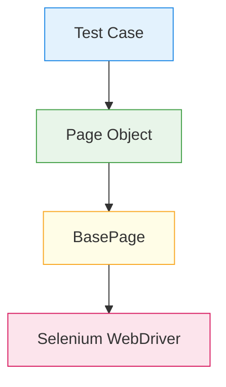

# 🧪 Automation Framework Design Workshop  
**Python • Selenium • Pytest**

> This repository represents a **framework-building workshop**, not a feature-complete automation project.  
> The primary goal is to demonstrate **how an automation framework evolves phase by phase**, with emphasis on **design decisions, abstraction boundaries, and debugging insights**.

The application under test is used only as a **learning surface**.  
The focus is on **how** the framework is built, not **what** is automated.

---

## 🎯 Workshop Objective

To build an **interview-ready, maintainable automation framework** by progressing through **nine deliberate phases**, each solving a specific engineering problem commonly faced in real-world automation teams.

---

## 🧭 Framework Evolution Phases (All 9)

| Phase | Name | Focus Area | Key Learnings |
|------|------|-----------|--------------|
| Phase 0 | Mindset & Intent | Framework thinking | Scripts vs frameworks, separation of concerns |
| Phase 1 | Execution Skeleton | Basic execution | Pytest discovery, browser launch, teardown |
| Phase 2 | Driver Lifecycle | Fixtures | `yield`, setup vs teardown, lifecycle safety |
| Phase 3 | Base Abstraction | BasePage design | Centralized Selenium interactions |
| Phase 4 | Page Object Model | UI encapsulation | Locators + page-level behavior |
| Phase 5 | Redundancy Control | Page fixtures | Avoiding globals, reusable page instances |
| Phase 6 | Debugging & Corrections | Real failures | Visibility vs presence, recursion, Python pitfalls |
| Phase 7 | Stabilization & Readability | Test quality | Intent-driven tests, clean assertions |
| Phase 8 | Interview Readiness | Explanation & defense | Articulating design decisions clearly |

> ⚠️ Not all phases introduce new files.  
> Some phases refine **how existing code is structured, used, or explained**, which is equally critical in professional automation work.

---

## 🧱 Final Framework Structure

automation-practice-framework/
│
├── base/
│   ├── __init__.py
│   └── basepage.py          # Generic Selenium interaction logic
│
├── pages/
│   ├── __init__.py
│   └── practice_page.py     # Page Object (UI behavior)
│
├── tests/
│   ├── __init__.py
│   └── test_conceptDemo.py  # Intent-driven tests
│
├── conftest.py              # Fixtures (driver + page lifecycle)
├── requirements.txt
└── README.md

---

## 🧠 Core Concepts Covered

| Concept | Demonstration |
|------|---------------|
| Pytest test discovery | Naming conventions |
| Pytest fixtures | `driver` and page fixtures |
| Fixture lifecycle | `yield`-based setup and teardown |
| BasePage pattern | Centralized click, type, visibility logic |
| Page Object Model | UI behavior encapsulation |
| Abstraction boundaries | Tests → Pages → BasePage → Selenium |
| Visibility vs presence | `is_displayed()` vs DOM existence |
| Python method calls | Method reference vs invocation (`()`) |
| Recursion pitfalls | Avoiding self-calling methods |
| Redundancy reduction | Page objects via fixtures |
| Flaky test prevention | Correct wait strategy selection |

---

## 🧪 Conceptual Test Flow (Visualized)

Here we **do use Mermaid**, because flow diagrams are exactly what Mermaid is for.

## 🧪 Conceptual Test Flow

- Tests express **intent**
- Page Objects express **UI behavior**
- BasePage expresses **interaction mechanics**

---

## 🚫 What This Repository Is NOT

- ❌ Not a UI coverage showcase  
- ❌ Not a Selenium playground  
- ❌ Not focused on automating every element  

The value lies in **framework design, reasoning, and debugging**, not test count.

---

## 🧠 Key Learnings from the Workshop

- Fixtures manage lifecycle; globals break lifecycle
- BasePage handles *how* to interact, not *what* to interact with
- Page Objects contain behavior, not assertions
- Tests should read like specifications, not Selenium scripts
- Small Python mistakes can invalidate correct UI behavior
- Debugging framework issues is a core automation skill

---

## 🎤 Interview Usage

This repository can be used to explain:

- How to build an automation framework from scratch
- Why certain design patterns were chosen
- How real-world automation issues were debugged
- How to reason about stability, maintainability, and readability

**Suggested interview explanation:**

> “This repository documents a framework-building workshop.  
> The focus is not the site under test, but how the framework evolved phase by phase, including the mistakes and corrections that shaped the final design.”

---

## 🔮 Possible Extensions (Out of Scope)

- Reporting (pytest-html / Allure)
- Screenshot capture on failure
- Config-driven execution
- Parallel execution
- CI/CD integration

These were intentionally excluded to keep the workshop focused.

---

## 👤 Author

**Harish**  
Automation QA | Python | Selenium | Pytest  

> Built as part of a deliberate automation framework design workshop.
